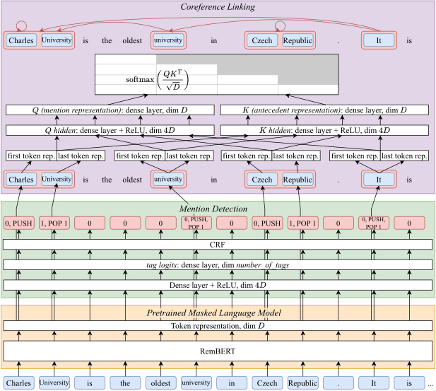

# ÚFAL CorPipe: CRAC 2022 Winning System for Multilingual Coreference Resolution

This repository contains the source code of CorPipe, which is available under
the MPL-2.0 license. The architecture of CorPipe is described in the following
paper:

---



<h3 align="center"><a href="TODO">ÚFAL CorPipe at CRAC 2022: Effectivity of Multilingual Models for Coreference Resolution</a></h3>

<p align="center">
  <b>Milan Straka</b> and <b>Jana Straková</b><br>
  Charles University<br>
  Faculty of Mathematics and Physics<br>
  Institute of Formal and Applied Lingustics<br>
  Malostranské nám. 25, Prague, Czech Republic
</p>

**Abstract:** ÚFAL CorPipe is a winning submission to the CRAC 2022 Shared Task
on Multilingual Coreference Resolution. Our system first solves mention
detection and then coreference linking on the retrieved spans with an
antecedent-maximization approach, and both tasks are fine-tuned jointly with
shared Transformer weights. We report results of fine-tuning a wide range of
pretrained models. The center of this contribution are fine-tuned multilingual
models. We found one large multilingual model with sufficiently large encoder to
increase performance on all datasets across the board, with the benefit not
limited only to the underrepresented languages or groups of typologically
relative languages.<br clear="both">

---

## Content of this Repository

- The directory `data` is for the CorefUD 1.0 data, and the preprocessed
  and tokenized version needed for training.
  - The script `data/get.sh` downloads and extracts the CorefUD 1.0 training and
    development data, plus the unannotated test data of the CRAC 2022 shared
    task.

- The `corpipe.py` is the complete CorPipe source file.

- The `corefud-score.sh` is an evaluation script used by `corpipe.py`, which
  - runs validation (using the official UD validator from the `validator` submodule) on the output data,
  - perform evaluation (using the official evaluation script from the `corefud-scorer` submodule), both
    without and with singletons.

- The `res.py` is our script for visualizing performance of running and finished
  experiments, and for comparing two experiments. It was developed for our needs
  and we provide it as-is without documentation.

## Training the CorPipe “Multilingual” Variant

To train a single multilingual model on all the data, you should
1. run the `data/get.sh` script to download the CorefUD data,
2. create a Python environments with the packages listed in `requirements.txt`,
3. train the model itself using the `corpipe.py` script.

   For training the large variant using RemBERT variant, we used
   ```
   tb="ca_ancora cs_pcedt cs_pdt de_parcorfull de_potsdamcc en_gum en_parcorfull es_ancora fr_democrat hu_szegedkoref lt_lcc pl_pcc ru_rucor"
   corpipe.py $(for c in $tb; do echo data/$c/$c; done) --resample=6000 4 5 5 1 2 3 1 4 4 3 2 4 3 --epochs=20 --lazy_adam --learning_rate_decay --crf --batch_size=8 --bert=google/rembert --learning_rate=1e-5 --segment=512 --right=50 --exp=large-rembert
   ```

   To train a base variant using XLM-R base, we used
   ```
   tb="ca_ancora cs_pcedt cs_pdt de_parcorfull de_potsdamcc en_gum en_parcorfull es_ancora fr_democrat hu_szegedkoref lt_lcc pl_pcc ru_rucor"
   corpipe.py $(for c in $tb; do echo data/$c/$c; done) --resample 6000 4 5 5 1 2 3 1 4 4 3 2 4 3 --epochs=30 --lazy_adam --learning_rate_decay --crf --batch_size=8 --bert=jplu/tf-xlm-roberta-base --learning_rate=2e-5 --segment=512 --right=50 --exp=base-xlmr
   ```

Currently no model is saved; instead, the script performs and saves predictions
on both the development and test sets after every epoch.
